## What is This Repository 

- Learning javascript from basic to advance

## How To Use this Repository

- First download the Repository
- Open folder with vs code 
- Start from js-1 folder and start Learning
- look at the code of main.js of every folder to understand what a particular folder teach

## Authors

- [@Shivang Ramola](https://github.com/shiv7700)

## Javascipt Learning Path

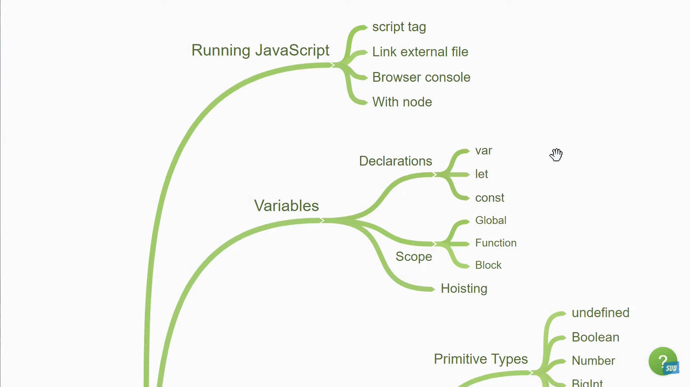
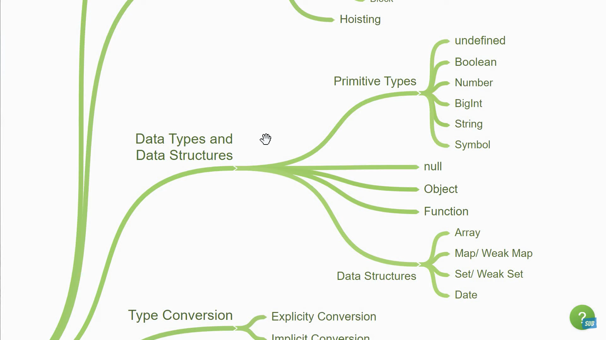
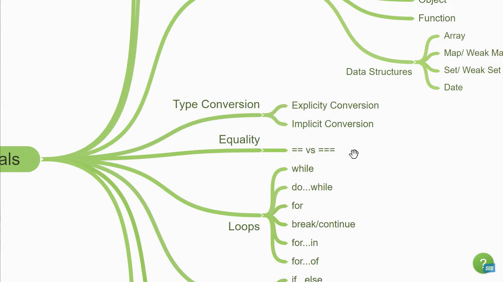
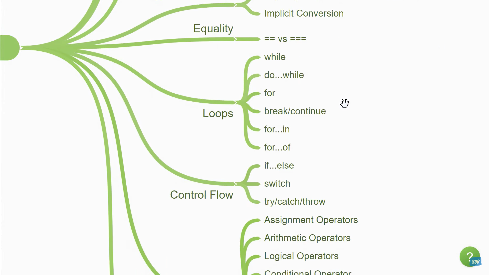
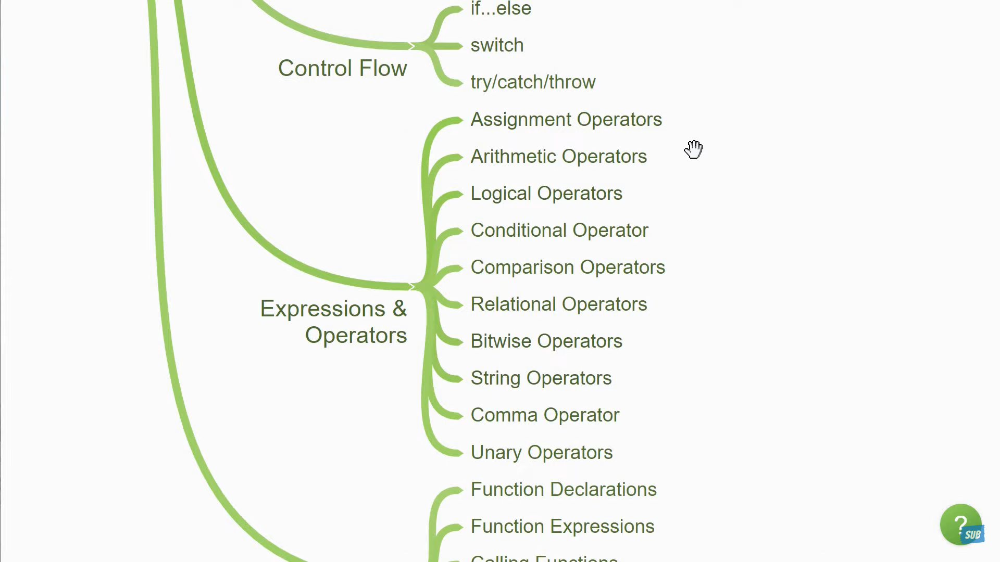
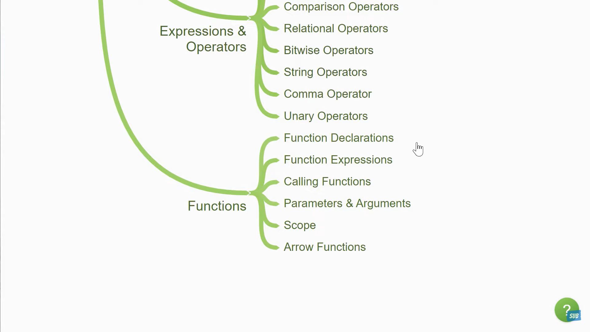
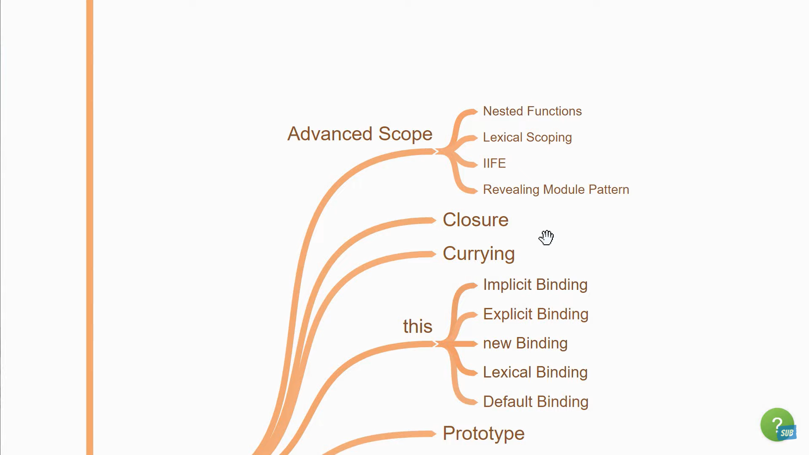
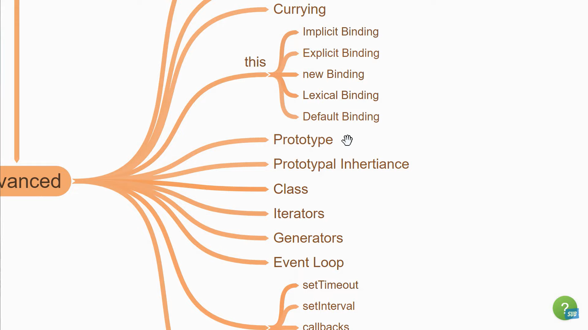
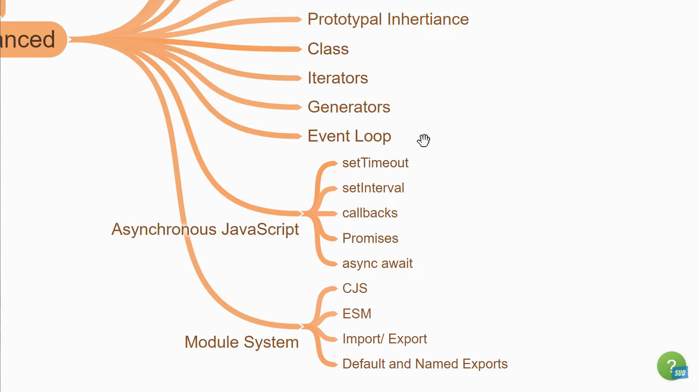
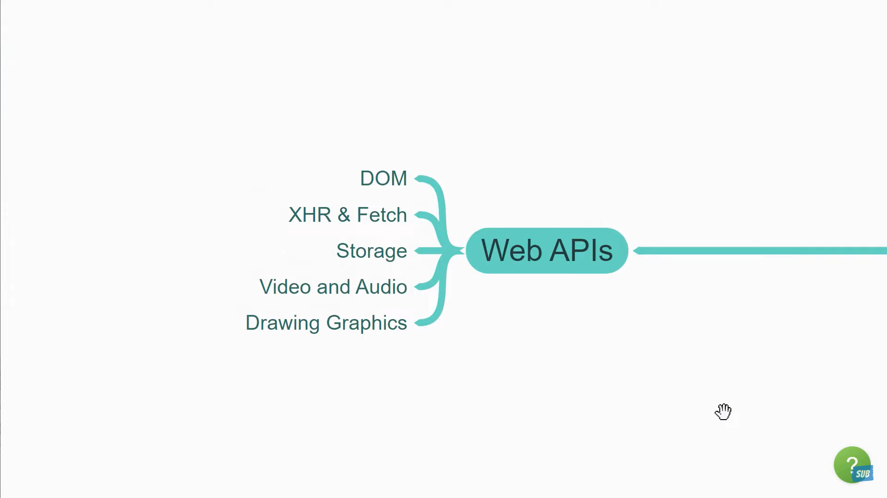
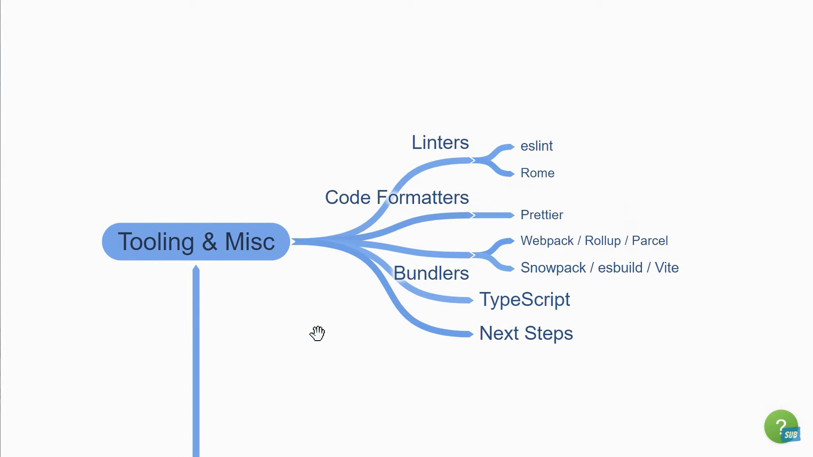

